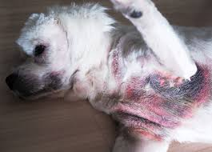

# 🐶Dog-skin-disease-detection
A deep learning-based image classification system to detect dog skin diseases using the **MobileNetV2** architecture.
## 📌 **Overview**
Skin diseases are common in dogs and can range from infections to allergies. Early detection is crucial for effective treatment. This project presents a **lightweight CNN-based image classifier** that predicts dog skin diseases from images using **MobileNetV2**, optimized for small datasets.
## 🧪 Diseases Detected

- 🦠 **Bacterial Dermatosis**  
- 🍄 **Fungal Infections**  
- ✅ **Healthy**  
- 🤧 **Hypersensitivity / Allergic Dermatosis**

## 🚀 Demo

| Upload Image | Prediction |
|--------------|------------|
|  | **Predicted: Fungal Infections** |

---

## 🧠 Model Architecture
- **Base Model**: MobileNetV2 (pretrained on ImageNet)
- **Input Size**: 224 x 224
- **Loss Function**: Categorical Crossentropy / Focal Loss (customizable)
- **Optimizer**: Adam
- **Augmentation**: Rotation, Flip, Zoom, Contrast, etc.
- **Dataset**: Combination of [YashMotiani Dog Skin Dataset](https://www.kaggle.com/datasets/yashmotiani/dogs-skin-disease-dataset) and filtered dog images from multi-animal datasets

---
## 📦 Requirements
- TensorFlow
- NumPy
- Matplotlib
- Keras
- PIL

## 📁 Project Structure

```
Dog-Skin-Disease-Detection/
│
├── best_model.keras                  # Trained model
├── Dog_Skin_Disease_Detection.ipynb  # Colab notebook (full pipeline)
├── predict_skin_disease.py           # Script for single image prediction (optional)
├── images/
│   └── sample_dog.png                # Example image used in README
├── README.md                         # This file
```
## 📸 How to Use

### 🟢 In Google Colab
1. **[▶️ Click here to run on Colab](https://colab.research.google.com/drive/1Mwq3SdE8773IE42tAYMjmUqrMGQhLBch?usp=sharing)**  
2. Upload your `.jpg` or `.png` image when prompted.  
3. Wait for the prediction result and visualization.

> 💡 The model will display the uploaded image along with the predicted disease label.
> 
## 📊 Results
✅ **Test Accuracy: 90%**
## 📈 Classification Report:

Insert precision, recall, F1-score for each class here
## 📉 Confusion Matrix: 
## ✅ Features
✔️**Lightweight & Fast (MobileNetV2)**  
✔️ **Trained on limited data**  
✔️ **Google Colab Friendly**  
✔️ **Expandable to more skin diseases**  

## 📌 **Future Work**  
• Add more classes (e.g., Mange, Tumors)  
• Convert into a mobile/web app  
• Improve fungal prediction using targeted augmentation  

---

### 👨‍💻Author  
**Aniga Suresh**  
Feel free to connect via [GitHub](https://github.com/) or [LinkedIn](https://linkedin.com/)!
